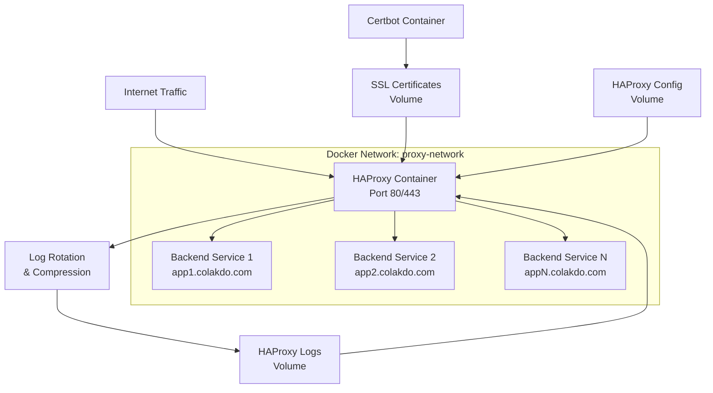

# Design Document

## Overview

This design implements a production-ready HAProxy reverse proxy with automated Let's Encrypt wildcard SSL certificate management for *.colakdo.com. The solution uses Docker Compose to orchestrate HAProxy, Certbot for certificate management, and creates a shared network for backend services.

## Architecture

The system consists of three main components:

1. **HAProxy Container**: Handles SSL termination and traffic routing
2. **Certbot Container**: Manages Let's Encrypt certificate generation and renewal
3. **Shared Docker Network**: Enables communication between HAProxy and backend services



## Components and Interfaces

### HAProxy Configuration

The HAProxy configuration will include:

- **Global Section**: Process management, SSL settings, and logging
- **Defaults Section**: Timeout settings and default behaviors
- **Frontend Section**: HTTP/HTTPS listeners with SSL termination
- **Backend Sections**: Service routing definitions with health checks

Key features:
- HTTP traffic rejection (returns 403 Forbidden) with option for HTTPS redirection
- SNI-based routing for subdomains
- Health checks for backend services
- Graceful configuration reloading

### Certbot Integration

Certbot will use DNS-01 challenge for wildcard certificate generation:

- **Initial Certificate Generation**: Automated on first startup
- **Renewal Process**: Cron-based renewal every 12 hours
- **HAProxy Reload**: Post-renewal hook to reload HAProxy configuration
- **DNS Provider Integration**: Configurable DNS plugin for domain validation

### Log Management Integration

HAProxy logging will be externalized and managed:

- **External Log Volume**: Logs written to mounted volume for persistence
- **Log Rotation**: Automated rotation using logrotate within container
- **Retention Policy**: Configurable retention (default 30 days)
- **Compression**: Rotated logs compressed to save space
- **Multiple Log Streams**: Separate access, error, and general logs
- **Structured Format**: JSON or standardized format for log analysis

### Docker Network Architecture

- **Network Name**: `proxy-network`
- **Driver**: Bridge network for container communication
- **Attachable**: Allows external containers to join the network
- **Service Discovery**: Containers accessible by service name

## Data Models

### Certificate Storage Structure
```
/etc/letsencrypt/
├── live/colakdo.com/
│   ├── fullchain.pem
│   ├── privkey.pem
│   └── cert.pem
└── renewal/
    └── colakdo.com.conf
```

### HAProxy Configuration Structure
```
/usr/local/etc/haproxy/
├── haproxy.cfg (main configuration)
├── certs/ (certificate directory)
├── errors/ (custom error pages)
└── logs/ (externalized log directory)
    ├── haproxy.log
    ├── access.log
    └── error.log
```

### Log Management Structure
```
/var/log/haproxy/
├── current/
│   ├── haproxy.log
│   ├── access.log
│   └── error.log
├── archive/
│   ├── haproxy.log.1.gz
│   ├── haproxy.log.2.gz
│   └── ...
└── logrotate.conf
```

### Environment Variables
- `DOMAIN`: Primary domain (colakdo.com)
- `EMAIL`: Let's Encrypt registration email
- `DNS_PLUGIN`: DNS provider plugin for Certbot
- `DNS_CREDENTIALS`: DNS API credentials file path

### HTTP Traffic Handling

The system will actively reject HTTP traffic by default:
- **HTTP Port 80**: Returns 403 Forbidden status
- **Security Headers**: Includes HSTS to prevent future HTTP attempts
- **Configuration Option**: Ability to switch between rejection and redirection modes
- **Logging**: All HTTP attempts are logged for security monitoring

## Error Handling

### Certificate Generation Failures
- Retry mechanism with exponential backoff
- Fallback to self-signed certificates for development
- Detailed logging of certificate generation attempts
- Email notifications for persistent failures

### HAProxy Configuration Errors
- Configuration validation before reload
- Rollback to previous working configuration on syntax errors
- Health check failures trigger backend removal
- Graceful degradation when backends are unavailable

### Network Connectivity Issues
- Connection timeout handling
- Automatic retry for transient failures
- Circuit breaker pattern for failing backends
- Monitoring and alerting for service availability

## Testing Strategy

### Unit Testing
- HAProxy configuration syntax validation
- Certbot renewal script testing
- Docker Compose service dependency verification

### Integration Testing
- End-to-end SSL certificate generation
- HAProxy routing to mock backend services
- Certificate renewal and HAProxy reload process
- Network connectivity between containers

### Load Testing
- SSL termination performance under load
- Backend service failover scenarios
- Configuration reload impact on active connections
- Memory and CPU usage monitoring

### Security Testing
- SSL/TLS configuration validation (SSL Labs)
- Certificate chain verification
- Security headers implementation
- Access control and rate limiting

## Implementation Considerations

### Performance Optimizations
- SSL session caching and resumption
- HTTP/2 support for modern browsers
- Connection pooling to backend services
- Efficient logging configuration

### Security Hardening
- Strong SSL cipher suites
- HSTS header implementation
- Security headers (CSP, X-Frame-Options, etc.)
- Rate limiting and DDoS protection

### Monitoring and Observability
- HAProxy statistics endpoint
- Certificate expiration monitoring
- Backend service health monitoring
- Structured logging for analysis
- Externalized log files with automatic rotation
- Log retention policies (configurable retention period)
- Compressed archived logs to save disk space

### Scalability Considerations
- Horizontal scaling of backend services
- Load balancing algorithm selection
- Session affinity when required
- Resource limits and auto-scaling